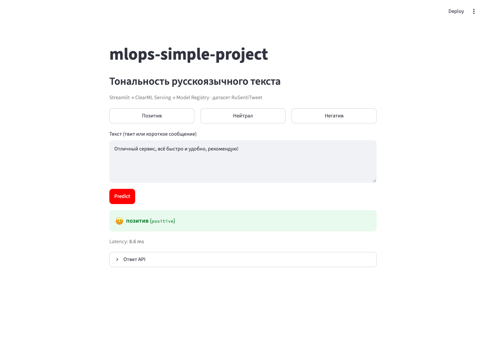
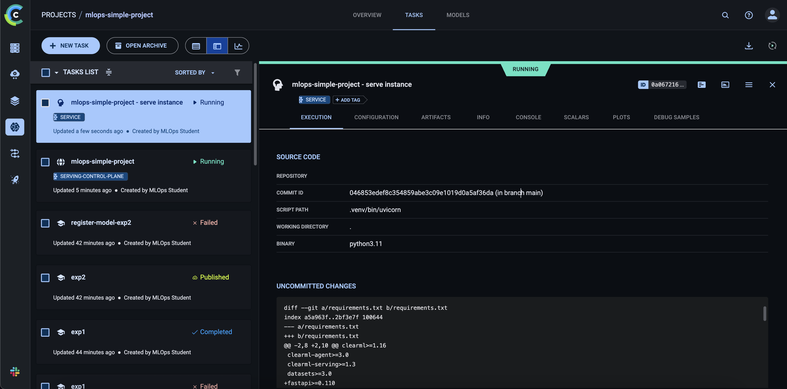

# mlops-simple-project — Курсовой проект

<p align="center">
  
  <br /><br />
  
</p>

Классификация тональности **русскоязычных твитов** ([RuSentiTweet](https://huggingface.co/datasets/psytechlab/RuSentiTweet)) через ClearML lifecycle.

**Стек:** Python, sklearn (TF-IDF + LogisticRegression), ClearML, Streamlit

**Классы:** `negative` / `neutral` / `positive`

---

## Структура проекта

```
├── docker/docker-compose.yaml      # ClearML Server
├── requirements.txt
├── scripts/
│   ├── prepare_data.py             # скачивает RuSentiTweet → data/raw/
│   ├── upload_dataset.py           # ЭТАП 1: ClearML Dataset
│   ├── train.py                    # ЭТАП 2: обучение через Agent
│   └── register_model.py           # ЭТАП 3: публикация в Registry
├── serving/preprocessing.py        # ЭТАП 4: preprocess для Serving
└── ui/app.py                       # ЭТАП 5: Streamlit UI
```

---

## Быстрый старт

```bash
# 1. Клонировать и установить зависимости
git clone https://github.com/anpilove/mlops-simple-project.git
cd mlops-simple-project
python3 -m venv .venv && source .venv/bin/activate
pip install -U pip && pip install -r requirements.txt

# 2. Поднять ClearML Server
cd docker && docker compose up -d && cd ..

# 3. Настроить SDK
#    → http://localhost:8080 → Settings → Workspace → Create new credentials
clearml-init

# 4. Запустить агент (отдельный терминал)
#    → Settings → Queues → New Queue → "students"
clearml-agent daemon --queue students --cpu-only --foreground

# 5. Загрузить датасет
PYTHONPATH=. python -m scripts.prepare_data
PYTHONPATH=. python -m scripts.upload_dataset   # сохрани dataset_id

# 6. Запустить 2 эксперимента
export DATASET_ID=<dataset_id>
PYTHONPATH=. python -m scripts.train --queue students --dataset-id $DATASET_ID \
  --max-features 5000 --C 0.1 --task-name exp1
PYTHONPATH=. python -m scripts.train --queue students --dataset-id $DATASET_ID \
  --max-features 20000 --C 1.0 --task-name exp2

# 7. Опубликовать лучшую модель
PYTHONPATH=. python -m scripts.register_model

# 8. Настроить и запустить Serving
clearml-serving --yes create --name "mlops-simple-project" --project "mlops-simple-project"
clearml-serving --yes --id <SERVICE_ID> model add \
  --engine sklearn --endpoint sentiment --published \
  --project mlops-simple-project --name tfidf-logreg-sentiment \
  --preprocess serving/preprocessing.py

CLEARML_SERVING_TASK_ID=<SERVICE_ID> CLEARML_BKG_THREAD_REPORT=1 \
  uvicorn clearml_serving.serving.main:app --host 0.0.0.0 --port 8088

# 9. Запустить UI
PYTHONPATH=. SERVING_URL=http://localhost:8088/serve/sentiment streamlit run ui/app.py
```

---

## Порты

| Сервис | URL |
|--------|-----|
| ClearML Web UI | http://localhost:8080 |
| ClearML API | http://localhost:8008 |
| ClearML Files | http://localhost:8081 |
| Serving (inference) | http://localhost:8088 |
| Streamlit UI | http://localhost:8501 |

---

## ЭТАП 0. Подготовка инфраструктуры

**1. Запустить ClearML Server**

```bash
cd docker && docker compose up -d && cd ..
docker compose -f docker/docker-compose.yaml ps
```

**2. Получить credentials**

1. Открыть http://localhost:8080
2. Settings → Workspace → Create new credentials
3. Скопировать `access_key` и `secret_key`

**3. Настроить SDK**

```bash
clearml-init
# API:   http://localhost:8008
# Web:   http://localhost:8080
# Files: http://localhost:8081
```

**4. Запустить Agent**

```bash
clearml-agent daemon --queue students --cpu-only --foreground
```

**Проверка:** Orchestration → Workers — agent online, task выполняется агентом.

> Mac / Apple Silicon: в compose указан `platform: linux/amd64`, agent без `--docker`.

---

## ЭТАП 1. Загрузка датасета

```bash
PYTHONPATH=. python -m scripts.prepare_data
PYTHONPATH=. python -m scripts.upload_dataset
```

Загружает RuSentiTweet в ClearML Dataset. Сохрани напечатанный `dataset_id`.

**Проверка:** Datasets → `rusentitweet-3class`, версия `1.0`.

---

## ЭТАП 2. Обучение через Agent

```bash
export DATASET_ID=<dataset_id>

PYTHONPATH=. python -m scripts.train --queue students --dataset-id $DATASET_ID \
  --max-features 5000 --C 0.1 --task-name exp1

PYTHONPATH=. python -m scripts.train --queue students --dataset-id $DATASET_ID \
  --max-features 20000 --C 1.0 --task-name exp2
```

Скрипт ставит task в очередь и завершается локально — обучение идёт на agent.

Логируется: гиперпараметры, accuracy, f1, confusion matrix, artifact и output model.

**Проверка:** Experiments → 2 задачи `exp1` / `exp2` с разными params и metrics.

---

## ЭТАП 3. Model Registry

```bash
PYTHONPATH=. python -m scripts.register_model
# или: --task-id <TASK_ID>
```

Выбирает лучший эксперимент по F1, публикует `tfidf-logreg-sentiment`.

**Проверка:** Models → статус Published, теги `sentiment`, `rusentitweet`, `tfidf-logreg`.

---

## ЭТАП 4. Inference Endpoint

Модель загружается из Registry, локальный `.pkl` не используется.

**Шаг 1. Создать Serving Service**

```bash
clearml-serving --yes create --name "mlops-simple-project" --project "mlops-simple-project"
# → сохрани SERVICE_ID
```

**Шаг 2. Задеплоить модель**

```bash
clearml-serving --yes --id <SERVICE_ID> model add \
  --engine sklearn \
  --endpoint sentiment \
  --published \
  --project mlops-simple-project \
  --name tfidf-logreg-sentiment \
  --preprocess serving/preprocessing.py
```

**Шаг 3. Запустить inference engine**

```bash
CLEARML_SERVING_TASK_ID=<SERVICE_ID> CLEARML_BKG_THREAD_REPORT=1 \
  uvicorn clearml_serving.serving.main:app --host 0.0.0.0 --port 8088
```

**Проверка:**

```bash
curl -X POST http://localhost:8088/serve/sentiment \
  -H "Content-Type: application/json" \
  -d '{"text": "Отличный сервис, всё быстро!"}'
# → {"label": "positive", "label_id": 2, ...}

curl -X POST http://localhost:8088/serve/sentiment \
  -H "Content-Type: application/json" \
  -d '{"text": "Нормально, без претензий."}'
# → {"label": "neutral", "label_id": 1, ...}

curl -X POST http://localhost:8088/serve/sentiment \
  -H "Content-Type: application/json" \
  -d '{"text": "Ужасное качество, больше не куплю."}'
# → {"label": "negative", "label_id": 0, ...}
```

---

## ЭТАП 5. UI

```bash
PYTHONPATH=. SERVING_URL=http://localhost:8088/serve/sentiment streamlit run ui/app.py
# → http://localhost:8501
```

UI: поле ввода, кнопка **Predict**, label, latency (ms). Работает через HTTP к serving, модель локально не загружается.
